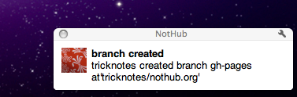
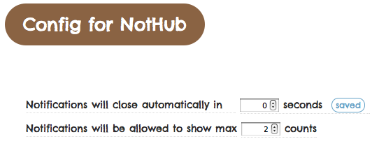

# [NotHub](http://nothub.org/)

> -Notification Client for GitHub-

## What is NotHub?

*NotHub* is a Chrome Extension for [GitHub](https://github.com) notification.

NotHub provides you to notify events that you are *just interested*.  
Furthermore, you can take notifications in *realtime*.

You can have a list different from GitHub.  
NotHub helps you to enjoy social coding more comfortably!

## Installation

Install from [here](https://chrome.google.com/webstore/detail/diioicfkgfbdhpdehliknpmmibenccno)

## How to use

### 1) Create your following list

### 2) Receive notification

It will tell you when your followings do something.

### 3) Enjoy!

:D

### Configurations (Optional)

Set up filters:

Adjust notification:

### Source

* [NotHub](http://github.com/tricknotes/nothub) - Chrome Extension
* [NotHub Stream](http://github.com/tricknotes/nothub-stream) - Server

## Author

Ryunosuke SATO ([@tricknotes](https://github.com/tricknotes))
